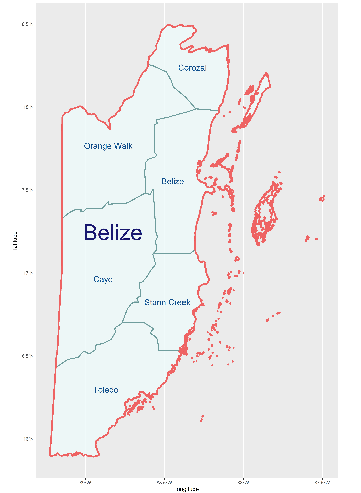

## Project 1: Belize

## Administrative Subdivisions of Belize

Belize has two administrative levels, ADM0 and ADM1. ADM0 is the countrys's boarder, while ADM1 breaks up the country into city and town councils.

Initially I was had picked Belarus for this project and done the first part of the project with Belarus. However, it was too large of a country for part two. Because of this when I made the Belize plot, all I had to do was substitute BLR for BLZ in the script. Additionally, Because Belize only has two administrative levels, the labels were much easier to place.

Here is the stretch goal map I had made for Belarus

