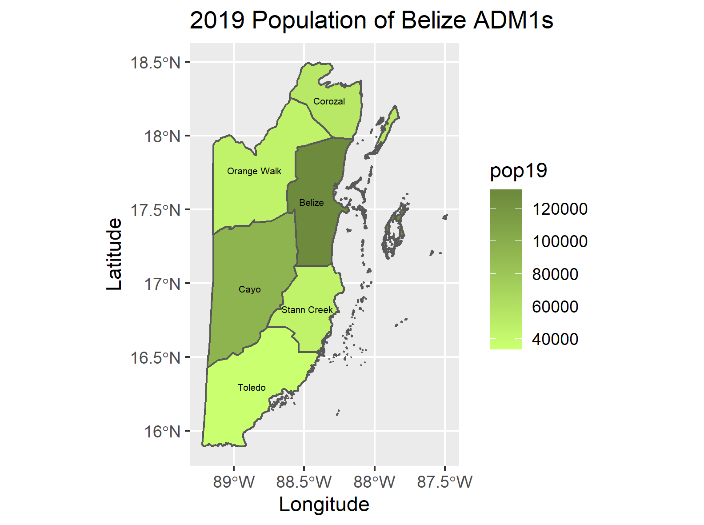
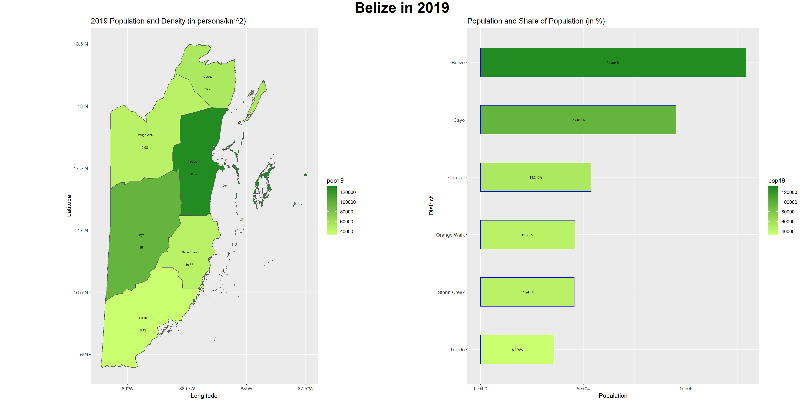

## Project 1: Belize

## Administrative Subdivisions of Belize

Belize has two administrative levels, ADM0 and ADM1. ADM0 is the countrys's border, while ADM1 breaks up the country into city and town councils. I am a part of geoboundaries at W&M and learned this week Belize actually has an ADM2 aswell, but GADM does not have a shapefile for it. There is limited data available, and Belize's ADM2 is one of the few geoboundaries does not have. 

Initially I was had picked Belarus for this project and done the first part of the project with Belarus. However, it was too large of a country for part two. Because of this when I made the Belize plot, all I had to do was substitute BLR for BLZ in the script. Additionally, Because Belize only has two administrative levels, the labels were much easier to place.

Here is the stretch goal map I had made for Belarus

## Populations of Belize's ADM1s

Belize has six districts in the first administrative level. Below is a map illustrating the population variation across these districts.

The district of Belize has the highest population and contains the country's capital, Belize city.

## Belize 2019 Population and Density

The population density of the district of Belize is the highest, as it contains the country's capital Belize city. Toledo has the lowest population density and is mostly uninhabitable places; rainforests and caves.

