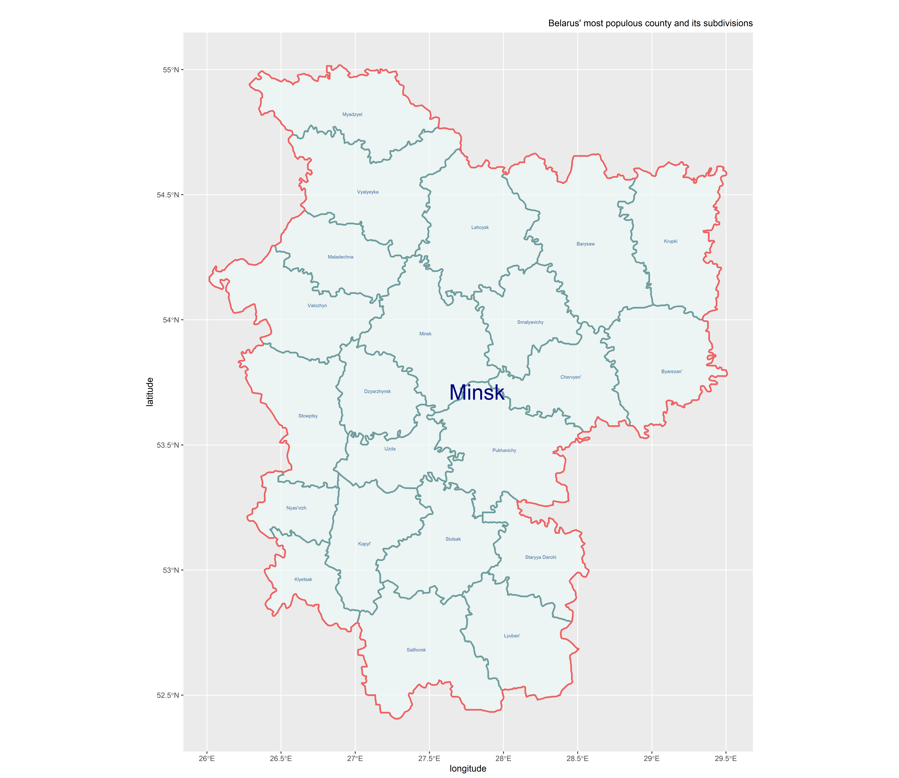

## Project 1: Belize

## Administrative Subdivisions of Belize

Belize has two administrative levels, ADM0 and ADM1. ADM0 is the countrys's border, while ADM1 breaks up the country into city and town councils. Belize actually has an ADM2 aswell, consisting of village, town, and city councils, however GADM does not have a shapefile for it and does not acknowledge its existence on their site. On campus I am part of geoboundaries and was recently tasked with finding the the boundaries for the second administrative level for Belize. Because of the limited data for Belize's second administrative level, it is one of the few ADM2s geoboundaries does not currently have.

Initially I was had picked Belarus for this project and done the first part of the project with Belarus. However, it was too large of a country for part two. Because of this when I made the Belize plot, all I had to do was substitute BLR for BLZ in the script. Additionally, Because Belize only has two administrative levels, the labels were much easier to place.

Here is the stretch goal map I had made for Belarus:

## Populations of Belize's ADM1s

Belize has six districts in the first administrative level. Below is a map illustrating the population variation across these districts.

The district of Belize has the highest population and contains the country's capital, Belize city. While the district of toledo has the lowest population and is the least developed district. Overall, Belize is a very small country both in physical size and population; in 2019 the country's total population was just under 400,000 people. To put that into context, Virgina Beach's population is just over 400,000 and Washington DC sits at around 700,000 people.

## Belize 2019 Population and Density

The map on the left is a chloropleth map of population, with labels for each district's population density. The chart on the right shows the percent of the total population contained in each district. The population density of the district of Belize is the highest, as it contains the country's capital Belize city. Toledo has the lowest population density and is the least developed district containing many rainforests and caves.

