## Acquiring, Modifying, and Describing the Data

Relationship between population and ntl
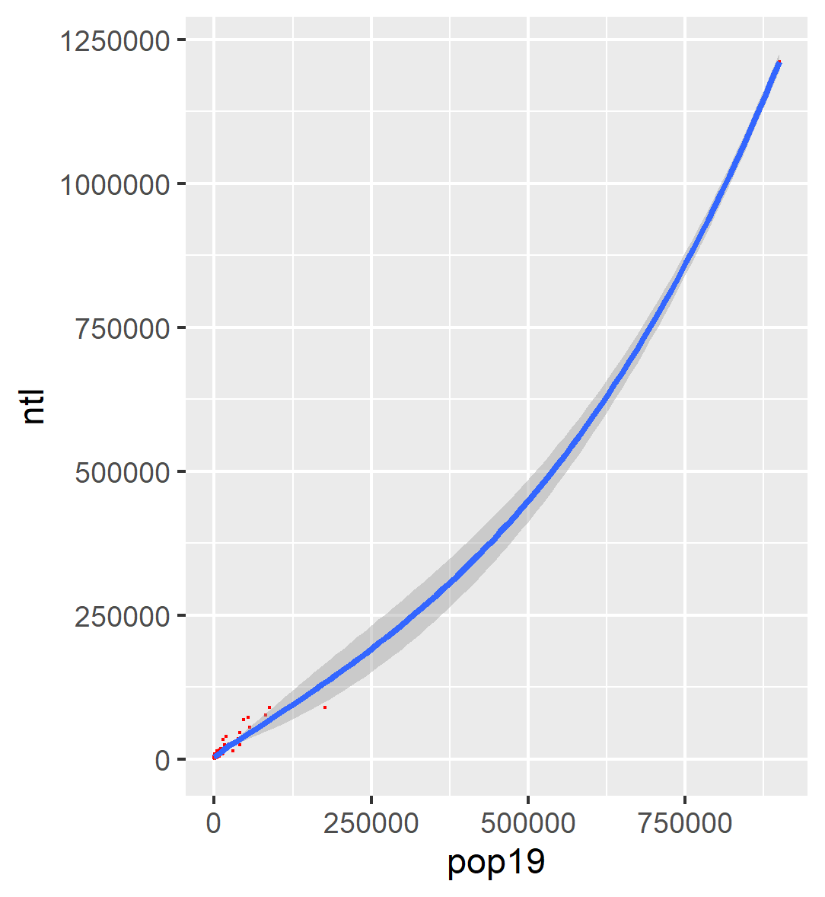

Probability density model of population
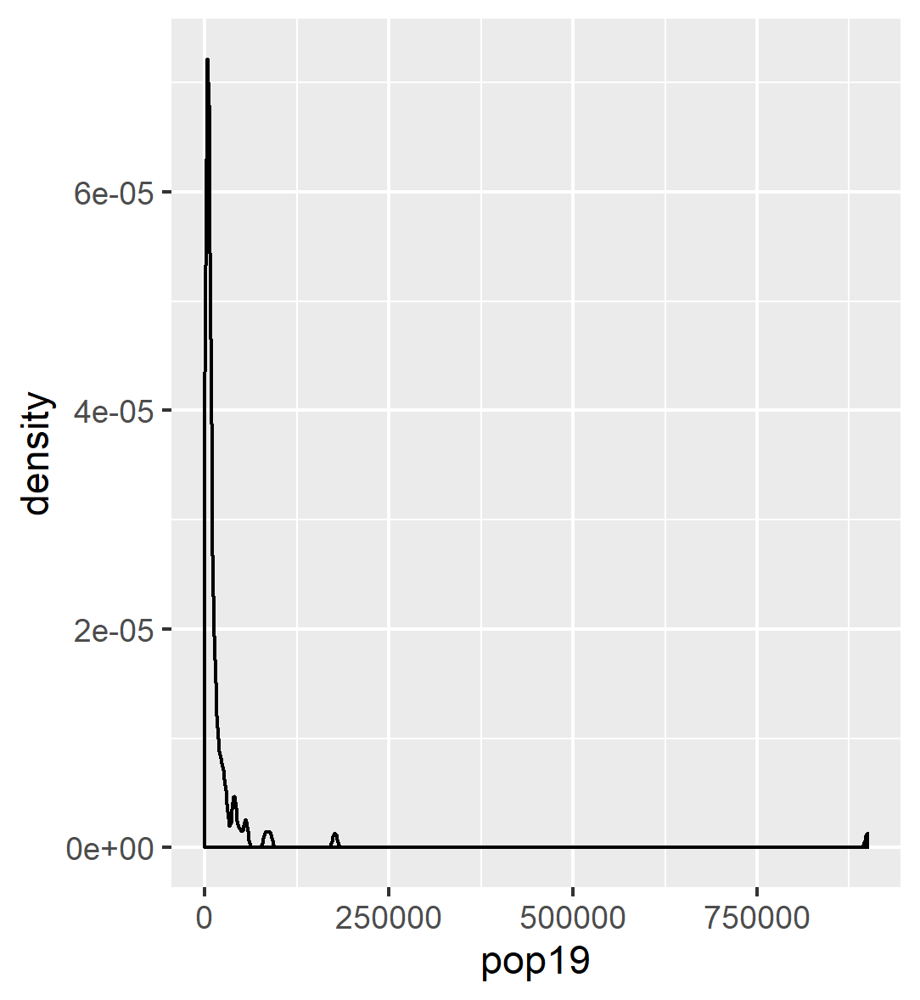
probability density is essentially the percent of the total at a level. In otherwords, it shows the proportion for the ADMs have a population bewteen two values to the total number of ADMs

Probability density model of log population
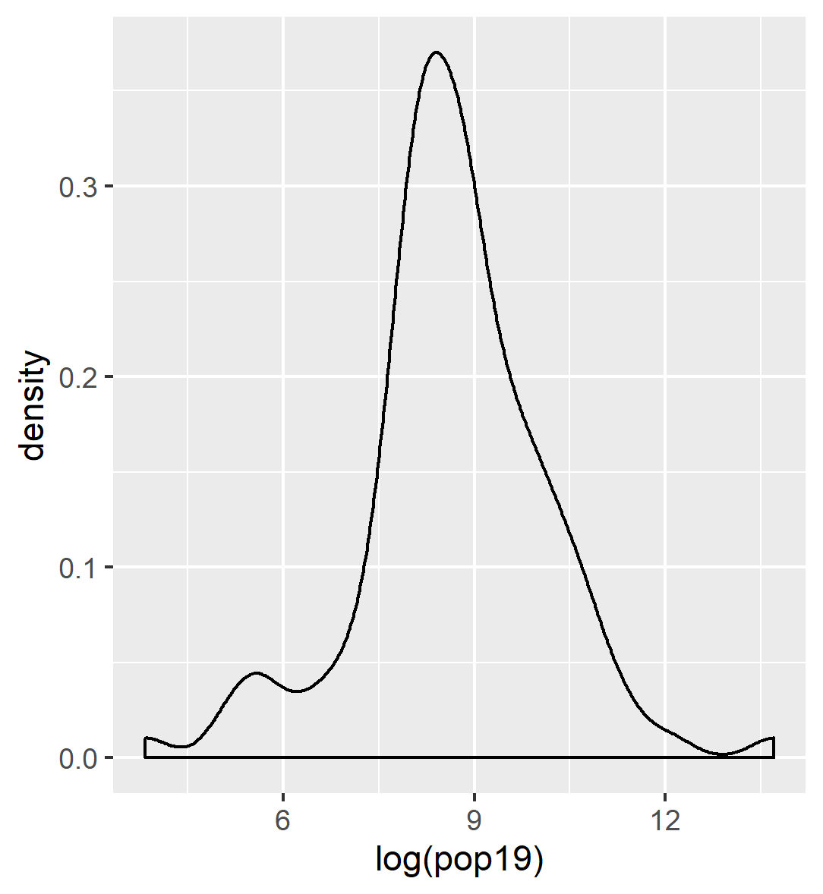

Probability density & histogram of population
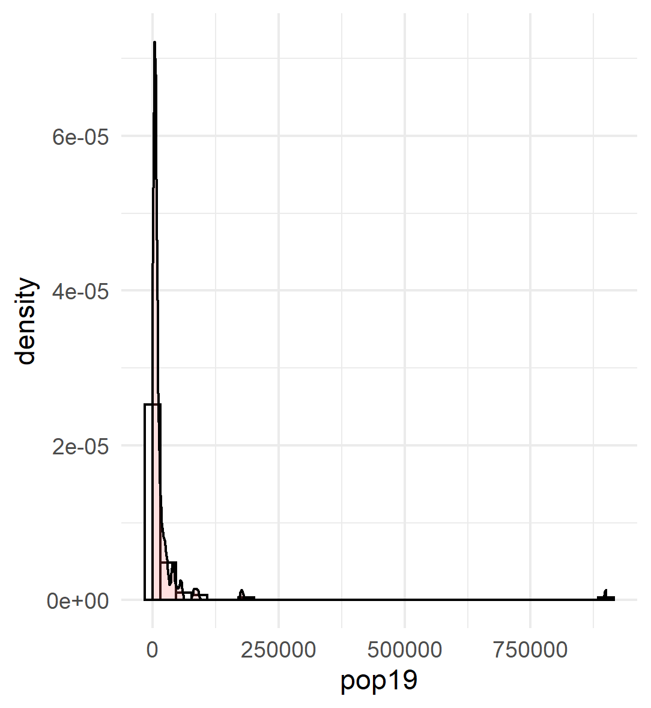

Probability density histogram of log population
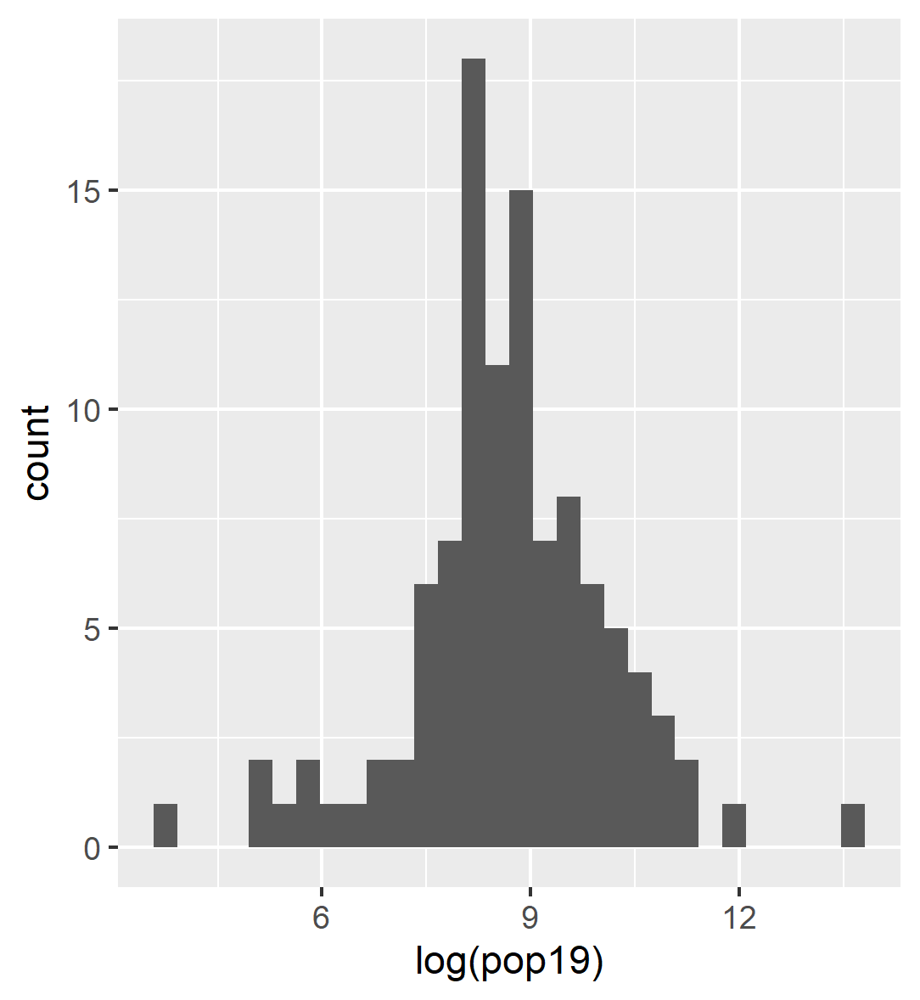

Probability density & histogram of log population
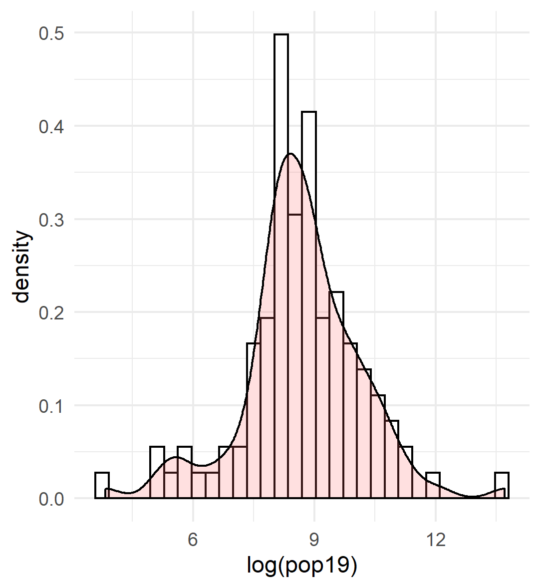

# models
residuals for model using population (2019) and ntl
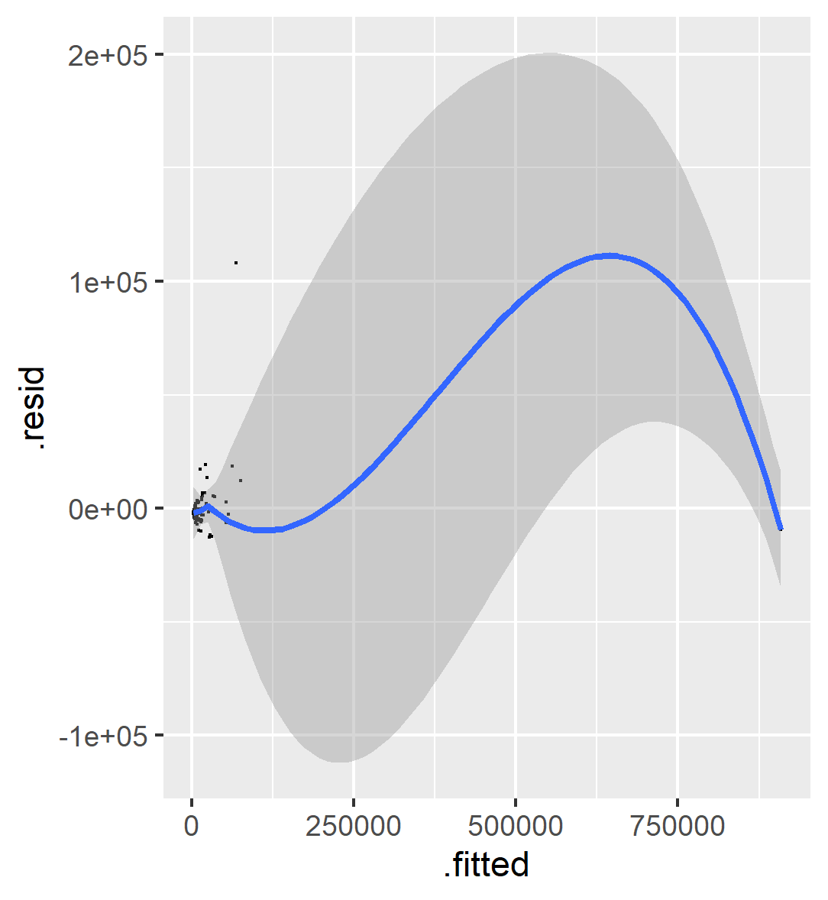
R-squared = 0.9819
p-value: < 2.2e-16

residuals for model using all variables
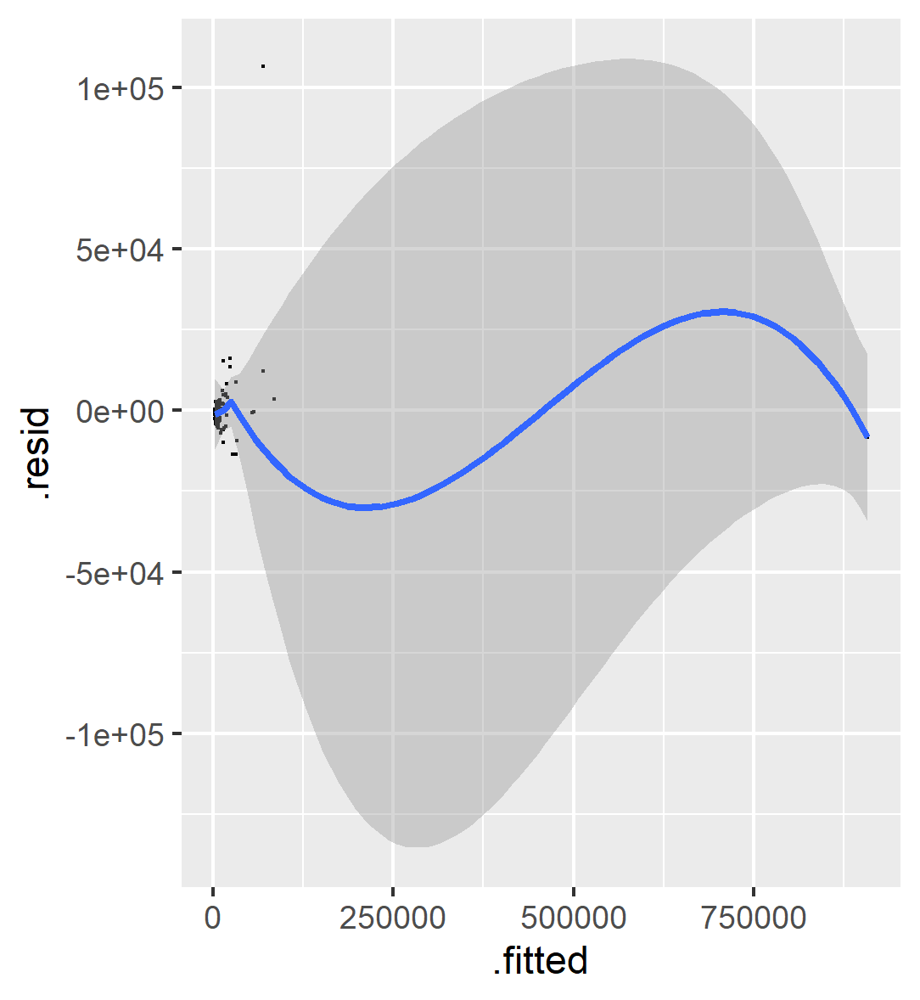
R-squared:  0.9833

# Difference in Population: Yucatan
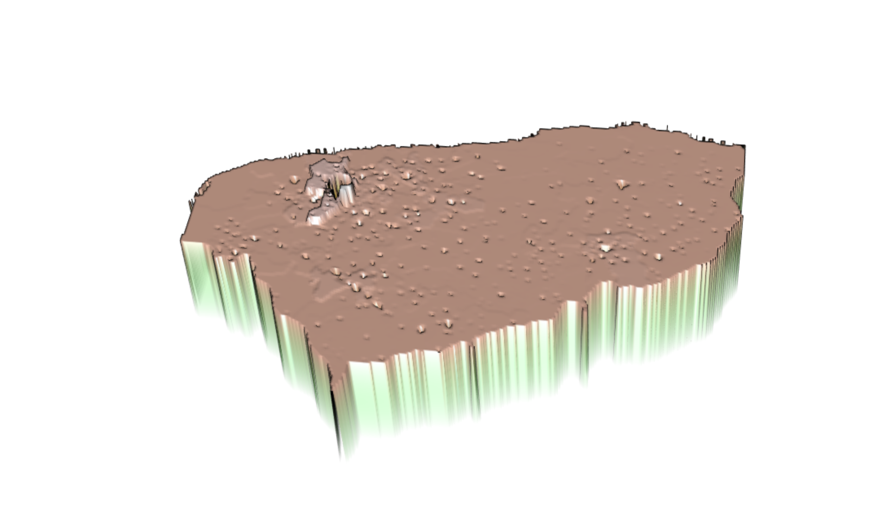
This plot shows the difference in predicted population and actual population for the Yucatan district of Mexico.

# Difference in Population: Merida
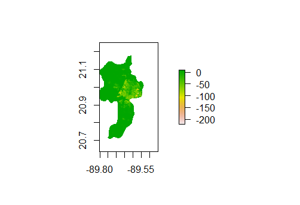
This plot shows the difference between the population predicted by the model and the actual population in 2019 for Merida, Mexico. The areas in red were yellow are where the model underpredicted the population.

# Predicted Population: Merida
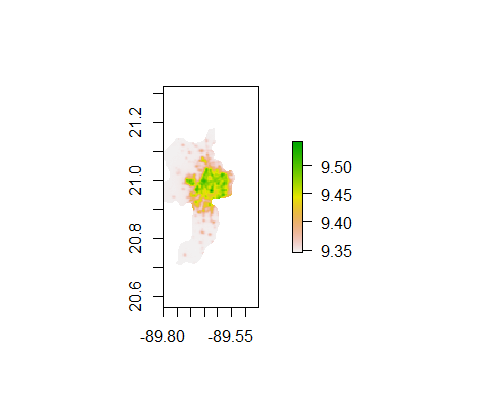
This plot shows the population predicted my the model in Merida county in Yucatan, Mexico

# Predicted Population: Merida
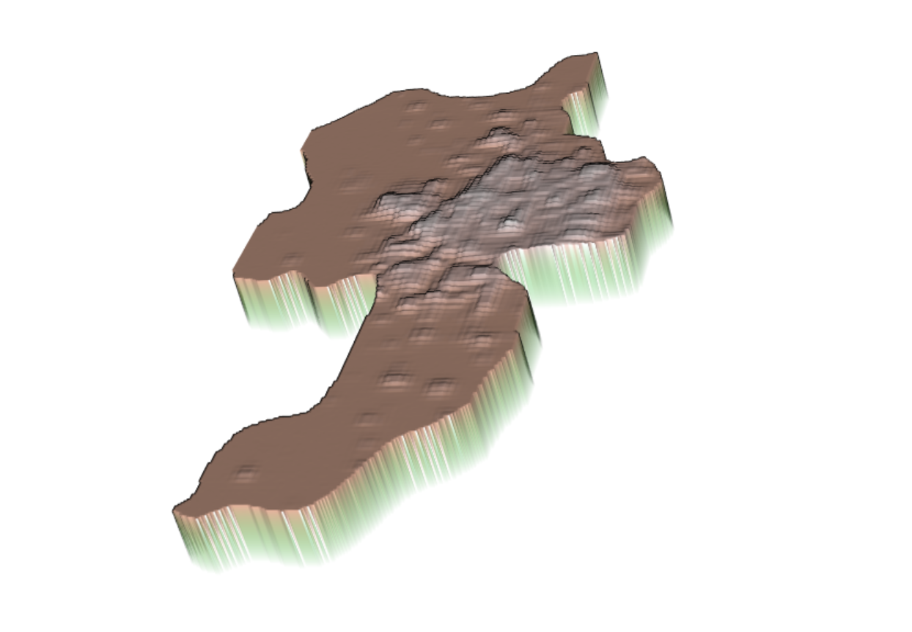
This plot is a 3-D representation of the same thing, the population predicted by the model. Both of these plots are for the city Merida, which is the most populous city in Yucatan, Mexico.

# Predicted Population: Merida
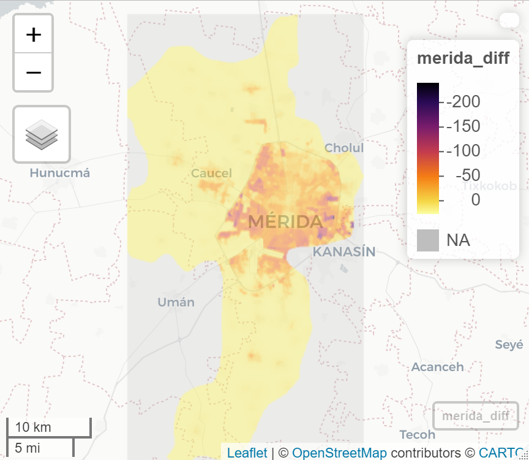
This map shows the differnce between the population predicted by the model and the actual population in 2019 for Merida, Mexico. The darker the area is, the more the model underpredicted population.

# Predicted Population: Merida
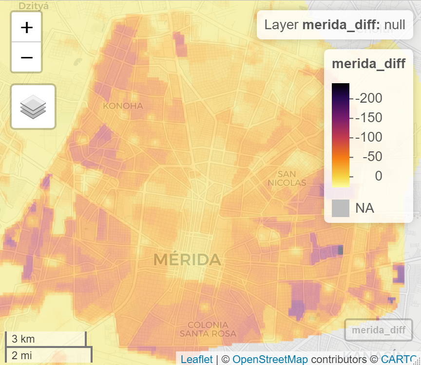 
This is a closeup of the previous map, zoomed into the more populated area. You can see the model underpredicted the population in most areas, which makes sense as the model was for 2015 and the actual population data was from 2019. Because the model was predicting population for 2015, not 2019, this map highlights population growth in the city. The darker areas had a greater increaese in population from the 2015 model to the actual 2019 data than the lighter regions.

# Sumamry
This model estimated population using land cover and land use data, along with night time lights, slope, and topography. Overall, this model was a strong predictor of population and had an R-squared value of 0.98, meaning the model is a very strong predictor for population in Yucatan. That being said, it is important to note the 'actual' population the model's prediction was compared to was from 2019, while the land use and land cover data was from 2015. I had tried to download and use the mexico 2015 population raster file from worldpop, however it wasn't downloading and said it would take 5 hours to download, so I used the 2019 population raster file instead.
