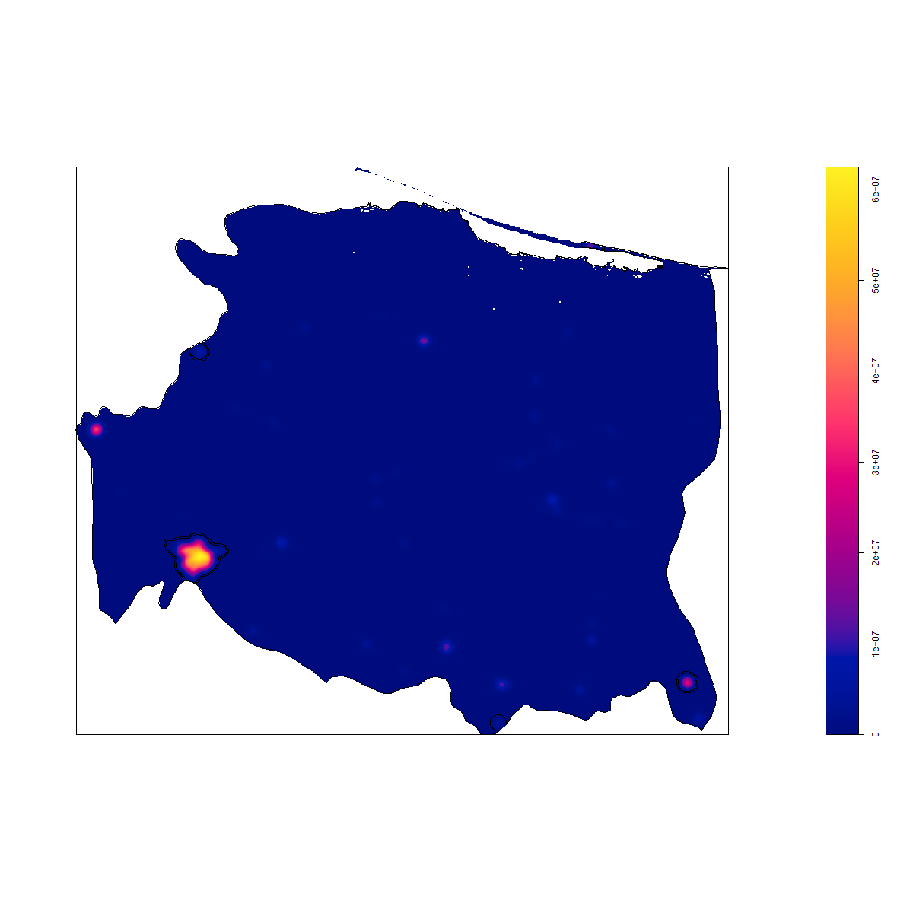
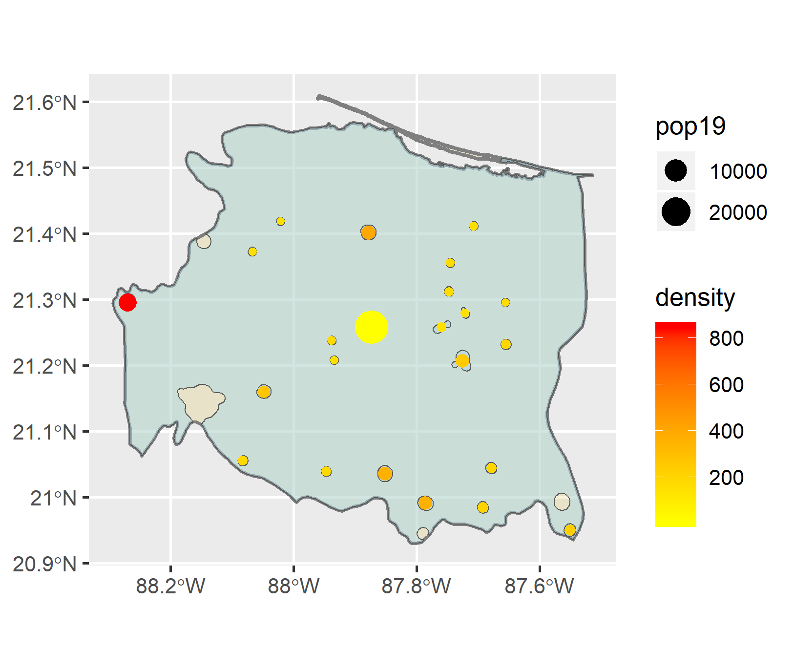
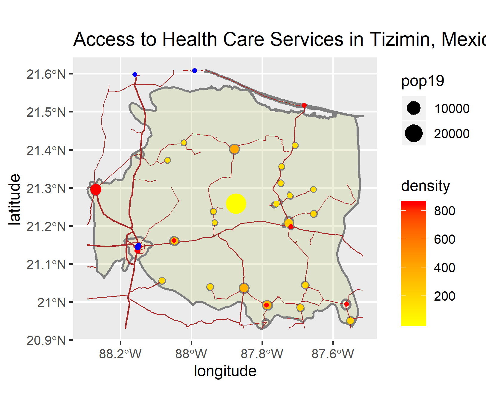

# Project 3: Accessibility to Healthcare through Transportation Networks
This project focuses on the ADM2 Tizimin, located in the Yucatan Penninsula Region of Mexico.

This plot shows the population density across Tizimin, with the lighter colors representing a higher density.

This first plot shows the locations of urban areas in Tizimin, with the density of each location represented by the color of the point, and the population of each area represented by the size of the point. Both of these factors are important, as urban areas tend to have both a high density and high population, and there are some areas in Tizimin with a high population or a high denisty that are not considered urban areas. 

This plot shoes the locations of health services (hospitals, doctors, and clinics) as blue points. Primary, secondary, and tertiary level roads are represented as brown lines. Urban areas are represented as points in the same way as in the previous plot; density is color and populations is size.
