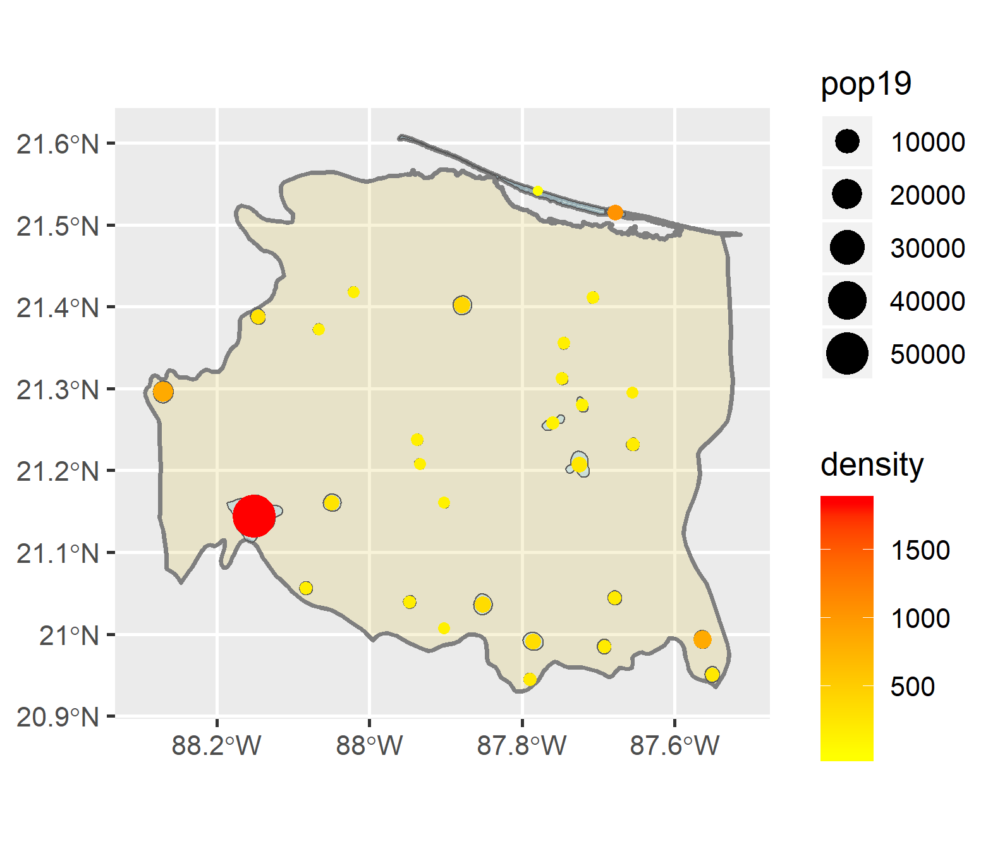

# Project 3: Accessibility to Healthcare through Transportation Networks
This project focuses on the ADM2 Tizimin, located in the Yucatan Penninsula Region of Mexico. Tizimin is the second largest ADM2 in Yucatan, Mexico, with a population of about 73,000 in 2010. The municipality contains one major city, Tizimin, with rainforests filling the remainder of the area.

This plot shows the population density across Tizimin, with the lighter colors representing a higher density. The lighter colored dot in the southwestern part of the region is the city of Tizimin, which had a population of around 46,000 in 2010. 

This first plot shows the locations of urban areas in Tizimin, with the density of each location represented by the color of the point, and the population of each area represented by the size of the point. Both of these factors are important, as urban areas tend to have both a high density and high population, and there are some areas in Tizimin with a high population or a high denisty that are not considered urban areas. 

This plot shoes the locations of health services (hospitals, doctors, and clinics) as blue points. Primary, secondary, and tertiary level roads are represented as brown lines. Urban areas are represented as points in the same way as in the previous plot; density is color and populations is size.
 Interestingly, you can see there are very few clinics/hospitals/doctors in Tizimin. There are a few located in the city of Tizimin, however there are none located throughout the rest of the municipality. Although there are two just out of the city limits, that are connected via roads to many of the urban areas in Tizimin, meaning those in the northern part of the country likley would leave the municipality to get medical attention.
