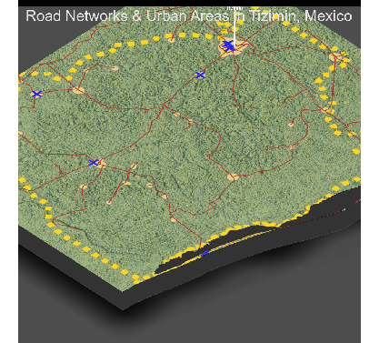

## Project 4: Further Analysis of Infrastructure and Services

Above is a 3D representation of Tizimin, Mexico. To help orient yourself, the southernmost border is the coast of the Gulf of Mexico
All healthcare facilities in Tizimin are located in urban areas and are connected through major road networks Tizimin City, the largest urban area, has two healthcare facilities, a hospital and a pharmacy.

Topography does not have a big impact in the placement of roads and urban areas in this region, as the majority of Tizimin is farmland, with the exception of the northeast (bottom most corner above) which is a nature preserve, and thus has no urban areas or roads. Additionally, because it is a nature preserve this region of Tizimin will never develop into an urban area or have roads or healthcare facilities. Otherwise, there are no physical features preventing a road, city, or healthcare facility from being built in any given place. 

