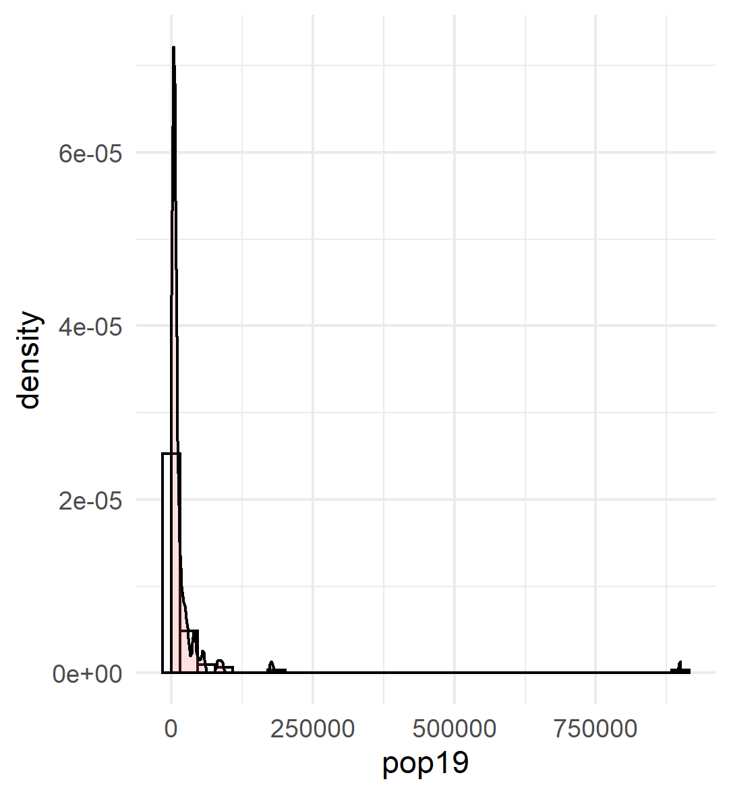
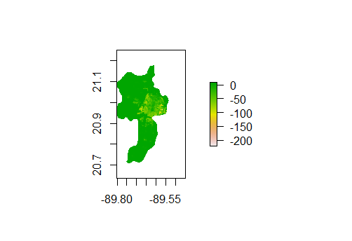
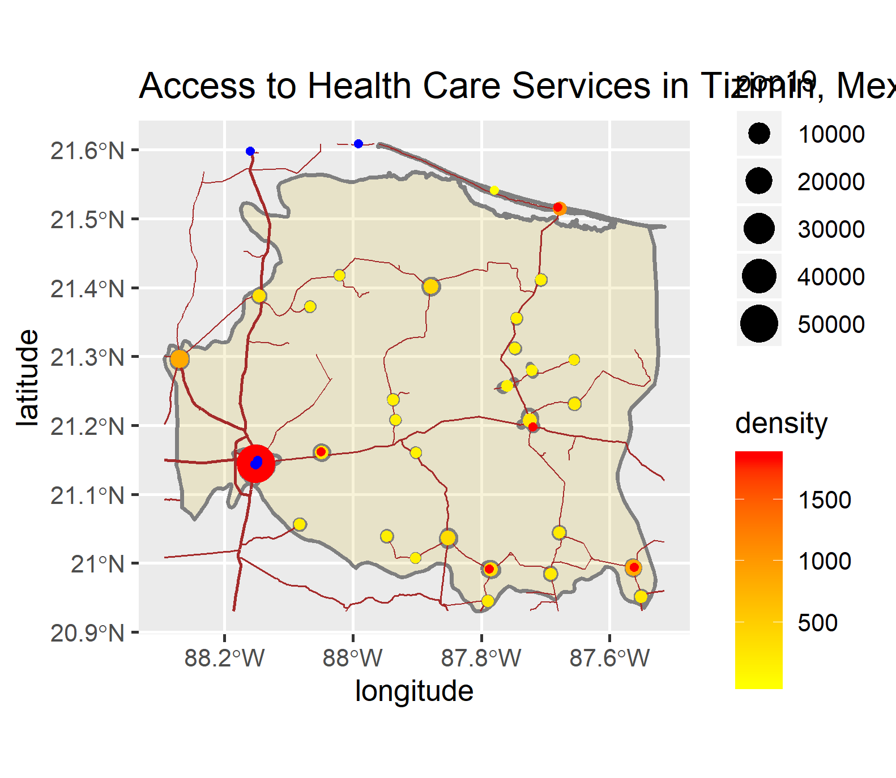

## An Analysis of the Current State of Human Development in Yucatan, Mexico 

# Political Subdivisions: Mexico
Mexico has three administrative levels, ADM0, ADM1, and ADM2. ADM0 is the country's international border, ADM1 consists of States, which are further broken down into municipalities (ADM2s). This project focuses on the ADM1 of Yucatan located in the Yucatan Penninsula in the Gulf of Mexico, and later zooms into the Tizimin and Merida Municipalities, located in Yucatan.

The map above shows Mexico and it's administrative regions. The first administrative region, states, are shown by the thicker green/blue lines. On the northern most part of the penninsula is the Yucatan state, which is focused on in the rest of the region. The fainter blue/purple lines divide the states into municipalities. 

The above map shows the municipalities located in the Mexican state of Yucatan. The two highlighted regions, Tizimin and Merida, are focused on in the remainder of this project. Merida has the highest population of any Yucatan municipality with a population of 1,142,000 in 2019. Tizimin has the second highest population at 46,000 in 2010.
 
# Yucatan Population

The above plot shows the actual 2019 population values for the municipalities in Yucatan. The one region in red, Meridia by far has the highest population in Yucatan. As mentioned previously, it's 2019 population was over one million, and is the only municipality in Yucatan with a population above one million.

Probability density & histogram of population

This graph shows the probability density of ADM2s in Yucatan, along with a histogram of population values. Probability density is essentially the percent of the total at a level. In otherwords, the it shows the proportion for the ADMs have a population bewteen two values to the total number of ADMs. The above graph shows that the majority of municipalities in Yucatan have a low population density. 

  To predict population in Yucatan Mexico, a model was created utilizing landcover and land use data, along with nighttime lights, slope, and topography. The population prediction is for 2015, when the aformentioned data is from, while the actual population values being compared are from 2019. To create these plots, population and covariate data were downloaded from worldpop.
  
The graph below shows the residuals for the created model utilizing all landuse and landcover covariates

The model's R-squared value is 0.9833. This is very high, meaning the model produced is a very accurate predictor of population. Because the residual is the actual value minus the predicted value, it is likely the one point with a residual of 1X10^5 is Merida, due to it's unordinarily high population for the region.

To expand on Merida and it's abnormally high population, below is a plot of the difference between actual 2019 and predicted population values in Merida.

The areas in red were yellow are where the model underpredicted the population. The model mostly underpredicted the population in the urban Merida city located in the center of the municipality. This occured the model used 2015 covariate data to predict population, thus it created a population estimate for 2015, which was then compared to actual 2019 population values. Becuase Merida city is a major urban area, the population is only increasing, thus the 2015 model underpredicted population. Interestingly, because of the different years used, this model can be used to show population growth. Assuming it is an accurate model of 2015 population, the areas shown to be underpredicted by the model have a higher actual 2019 population than predicted 2015 population, meaning they experienced population growth. The opposite is true for areas underpredicted by the model, which theoretically would have experienced a decline in population.
  A quick note on the data used; 2019 population values were used for comparison becuase the laptop in use failed to download the 2015 population raster file for Mexico.
  
# Tizimin Urban Areas, Roads, and Access to Healthcare Facilities

  Healthcare facility and road data used for this section were downloaded from HDX, and population data used to determine urban areas is from worldpop.

This plot shoes the locations of health services (hospitals, doctors, and clinics) as blue points. Primary, secondary, and tertiary level roads are represented as brown lines. Urban areas are represented as points in the same way as in the previous plot; density is color and populations is size.
Interestingly, you can see there are very few clinics/hospitals/doctors in Tizimin. There are a few located in the city of Tizimin, however there are none located throughout the rest of the municipality. Although there are two just out of the city limits, that are connected via roads to many of the urban areas in Tizimin, meaning those in the northern part of the country likley would leave the municipality to get medical attention.

-

Above is a 3D representation of Tizimin, Mexico. To help orient yourself, the southernmost border is the coast of the Gulf of Mexico, and the bottom right section of the municipality where the roads end is a nature preserve.
All healthcare facilities in Tizimin are located in urban areas and are connected through major road networks Tizimin City, the largest urban area, has two healthcare facilities, a hospital and a pharmacy.
Interestingly, in the 3d model shows more healthcare facilities than in the 2d plot shown before this one. This is likely due to the order of layers shown in the 3d plot causing the population points to cover healthcare facility points. 
Other than the nature preserve located in northeast Tizimin, there are no topographic features preventing the development of roads, healthcare facilities, or urban areas. The vast majority of this region is farmland, meaning it is unlikely to devlop much further as the main economic activities are agriculture, forestry, and fishing, meaning some land needs to remain undeveloped to sustain the municipalities economy. That being said, Tizimin is a highly devloped region, shown through the well establish and interconnected road network that links the many urban areas to eachother, and the rural communities to the healthcare facilities located in the urban areas. This road network is incredibly important to Tizimin's devlopment, as it is essential for connecting people to healthcare facilities, urban areas, and industry/jobs located in the urban areas. Overall, Tizimin is highly developed, although not as developed as Merida, and Tizimin city will likely continue to develop as the region changes overtime.

